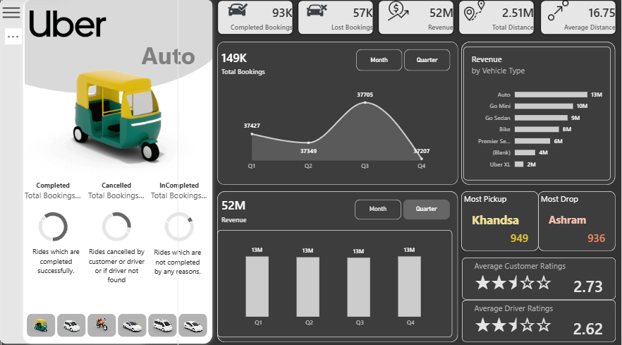
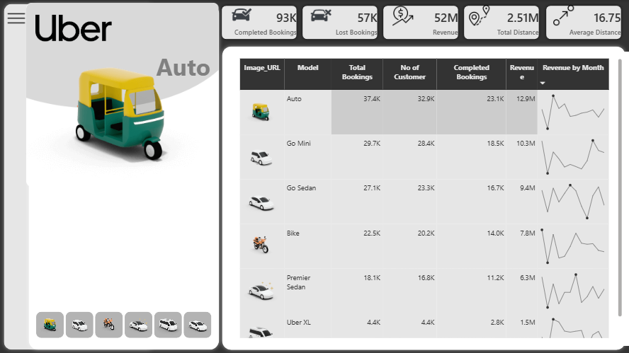
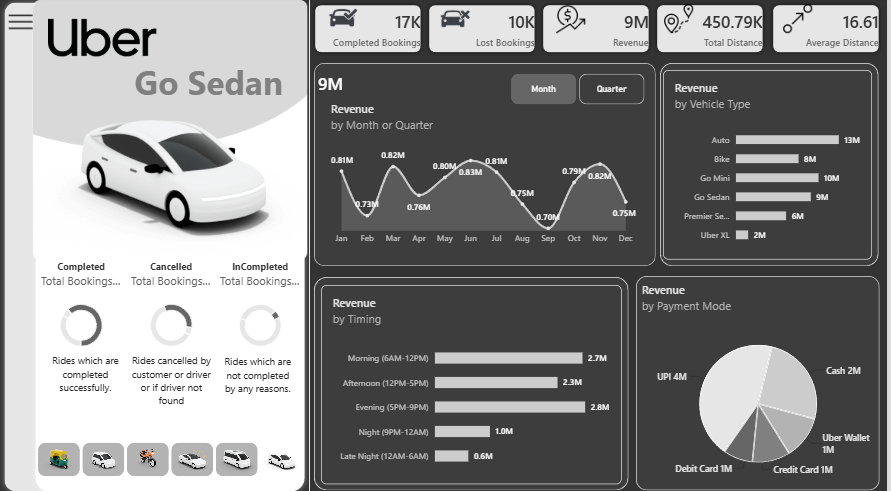
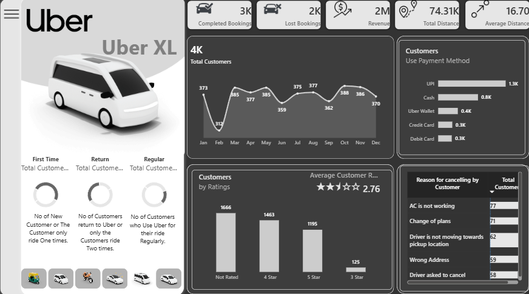

# 🚖 Uber Ride Analytics Dashboard

## 📊 Project Overview

The **Uber Ride Analytics Dashboard** is an interactive **Power BI dashboard** designed to analyze ride performance, revenue, customer behavior, vehicle performance, ratings, payment methods, and ride trends.

The project uses **SQL as the primary data source** and Power BI to transform raw ride data into meaningful business insights through interactive visualizations and KPIs.

### 📂 Alternative Dataset

If you do not want to connect the dashboard to a SQL database, an **Excel dataset is also provided in this repository**.

You can use the provided Excel file as an alternative data source to **recreate the analysis, build your own Power BI dashboard, and explore the same business metrics** without requiring a SQL connection.

---

## 🎯 Project Objectives

* Analyze overall ride and booking performance.
* Track completed, canceled, and incomplete rides.
* Monitor revenue and revenue per customer.
* Identify high-demand pickup locations.
* Analyze ride trends across different time periods.
* Understand customer payment preferences.
* Analyze customer and driver ratings.
* Compare ride performance across vehicle types.
* Monitor important operational and customer-related metrics.

---

## 🛠️ Tools & Technologies

* **SQL** — Data storage and data extraction
* **Power BI** — Dashboard development and visualization
* **Power Query** — Data cleaning and transformation
* **DAX** — KPI calculations and business measures
* **Excel** — Alternative dataset for recreating the analysis

---

## 📑 Dashboard Pages

### 🏠 Home

The **Home** page provides an introduction to the dashboard and acts as the main navigation point for exploring different analytical sections.

### 📊 Overview

The **Overview** page provides a high-level summary of overall ride performance, including key KPIs, booking trends, ride status, revenue, and other important business metrics.

### 🚘 Vehicles

The **Vehicles** page focuses on vehicle-level performance and helps analyze ride bookings, revenue, ratings, and other metrics across different vehicle types.

### 💰 Revenue

The **Revenue** page provides insights into revenue performance, revenue trends, revenue by vehicle type, payment methods, and revenue-related KPIs.

### 👥 Customer Analysis

The **Customer Analysis** page focuses on customer behavior, ratings, ride activity, payment preferences, and other customer-related metrics.

---

## 📌 Key Performance Indicators (KPIs)

The dashboard focuses on the following key performance indicators:

* 🚕 **Total Rides** — Total number of ride bookings.
* ✅ **Completed Rides** — Successfully completed rides.
* ❌ **Canceled Rides** — Rides canceled during the booking process.
* ⚠️ **Incomplete Rides** — Rides that were not successfully completed.
* 💰 **Total Revenue** — Revenue generated from rides.
* 👤 **Revenue per Customer** — Average revenue generated per customer.
* ⭐ **Average Customer Rating** — Overall customer rating performance.
* ⭐ **Average Driver Rating** — Overall driver rating performance.
* 📏 **Average Ride Distance** — Average distance covered per ride.
* 📍 **Top Pickup Location** — Location with the highest ride demand.

---

## 🧹 Data Cleaning & Transformation

Data cleaning and transformation were performed using **SQL and Power Query**.

The main steps included:

* Handling missing and blank values.
* Removing duplicate records.
* Correcting data types.
* Standardizing categorical values.
* Cleaning rating-related fields.
* Validating ride distance values.
* Standardizing payment method values.
* Creating required date and time attributes.
* Preparing the dataset for Power BI analysis.

---

## 📸 Dashboard Preview

### 🏠 Home

### 📊 Overview

### 🚘 Vehicles

### 💰 Revenue

### 👥 Customer Analysis

---

## 📝 Summary

This project demonstrates how **SQL, Power Query, DAX, and Power BI** can be combined to turn raw ride data into an interactive business intelligence solution.

The dashboard provides a structured view of **ride performance, vehicle usage, revenue generation, and customer behavior**, making it easier to explore key business metrics and identify meaningful patterns in the data.

The included **Excel dataset** also allows others to recreate the analysis and build their own version of the Uber Ride Analytics Dashboard without requiring a direct SQL connection.
